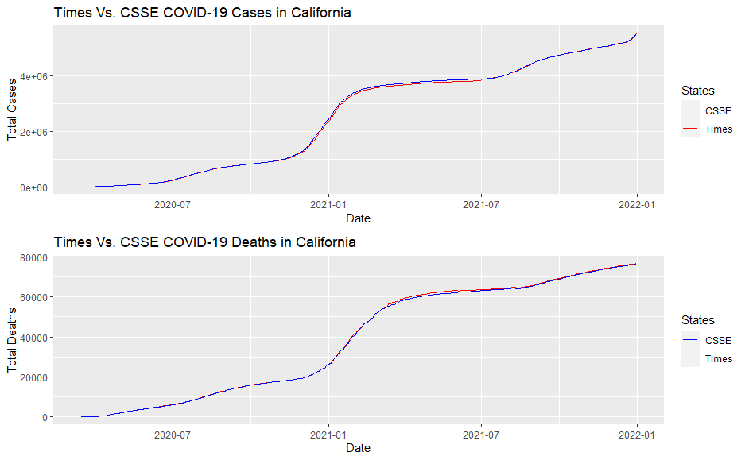

# COVID Analysis: A study in R
The goal of this project was to manipulate COVID-19 and population data across multiple soruces 
to solve desired inquiries. Local data from the United States as well as global data is analyzed.

The analysis was split into three separate Rmarkdown files.

## Table of Contents
- [Libraries Used](#libraries-used)
- [File Descriptions](#file-descriptions)
- [Functions](#functions)
- [Analysis and Results](#analysis-and-results)
- [Acknowledgements](#acknowledgements)


## Libraries Used
The following packages are required:
- tidyverse
- lubridate
- usmap
- gridExtra
- zoo

[Table of Contents](#table-of-contents)


## File Descriptions
The following files are found in this repository:
- **fips_population_estimates.csv**: county level population estimates
- **global_population_estimates.csv**: country level population estimates
- **README.md**: generates README in repository  
- **analysis_pt1.Rmd**: Rmarkdown file for part 1
- **analysis_pt1.pdf**: PDF generated by Rmarkdown file for part 1
- **analysis_pt2.Rmd**: Rmarkdown file for part 2
- **analysis_pt2.pdf**: PDF generated by Rmarkdown file for part 2
- **analysis_pt3.Rmd**: Rmarkdown file for part 3
- **analysis_pt3.pdf**: PDF generated by Rmarkdown file for part 3

Note that the images in the **Image** folder are ommitted from the above file descriptions,
as they are numerous and arbitrary without scope. These are used in the 
[Analysis and Results](#analysis-and-results) section.

Data is pulled from a github repository which hosts New York Times COVID-19 data. 
This provides county level data of cumulative cases and deaths. This is split into 3 years:
- [2020 Data](https://raw.githubusercontent.com/nytimes/covid-19-data/master/us-counties-2020.csv)
- [2021 Data](https://raw.githubusercontent.com/nytimes/covid-19-data/master/us-counties-2021.csv)
- [2022 Data](https://raw.githubusercontent.com/nytimes/covid-19-data/master/us-counties-2022.csv)

Global and US data is pulled from a github repository which hosts the Center for Systems Science and 
Engineering (CSSE) at Johns Hopkins University COVID-19 data. This is pulled in a few instances:
- [Global Deaths](https://raw.githubusercontent.com/CSSEGISandData/COVID-19/master/csse_covid_19_data/csse_covid_19_time_series/time_series_covid19_deaths_global.csv)
- [Global Cases](https://raw.githubusercontent.com/CSSEGISandData/COVID-19/master/csse_covid_19_data/csse_covid_19_time_series/time_series_covid19_confirmed_global.csv)
- [US Deaths](https://raw.githubusercontent.com/CSSEGISandData/COVID-19/master/csse_covid_19_data/csse_covid_19_time_series/time_series_covid19_deaths_US.csv)
- [US Cases](https://raw.githubusercontent.com/CSSEGISandData/COVID-19/master/csse_covid_19_data/csse_covid_19_time_series/time_series_covid19_confirmed_US.csv)

[Table of Contents](#table-of-contents)


## Functions
Most of the analysis follows singular pipeline code to either prepare tables or
plots. However, some of the data wrangling did present repeatable scenarios.

Functions:

**by_state(df, state):**
```
by_state <- function(df = df_with_pop_totals, state_name) {
  # filter by state
  df_state <- df %>%
  filter(state == state_name)
  
  # calculate new cases
  new_cases = c()
  for (i in 1:length(df_state$total_cases) - 1) {
    new_cases[i] = df_state$total_cases[i + 1] - df_state$total_cases[i]
  }
  new_cases = c(0, new_cases)
  
  # calculate new deaths
  new_deaths = c()
  for (i in 1:length(df_state$total_deaths) - 1) {
    new_deaths[i] = df_state$total_deaths[i + 1] - df_state$total_deaths[i]
  }
  new_deaths = c(0, new_deaths)
  
  # bind the new cases and deaths to the dataframe
  df_state <- df_state %>%
    cbind('new_cases' = new_cases, 'new_deaths' = new_deaths)
  
  
  # calculate the 7 day rolling averages for the new cases
  cases_roll_7 <- df_state %>%
    rollmean(x = new_cases, k = 7, align = 'right', fill = NA) %>%
    lag(n = 1)
  
  # calculate the 7 day rolling averages for the new deaths
  deaths_roll_7 <- df_state %>%
    rollmean(x = new_deaths, k = 7, align = 'right', fill = NA) %>%
    lag(n = 1)
  
  # bind the rolling cases and deaths to the dataframe
  df_state <- df_state %>%
    cbind('cases_roll_7' = cases_roll_7, 'deaths_roll_7' = deaths_roll_7)
  
  
  # add mutated versions of the 4 vectors created for the 100k by state result
  df_state <- df_state %>%
    mutate(new_cases_100 = (new_cases / state_pop) * 100000) %>%
    mutate(new_deaths_100 = (new_deaths / state_pop) * 100000) %>%
    mutate(cases_roll_100 = (cases_roll_7 / state_pop) * 100000) %>%
    mutate(deaths_roll_100 = (deaths_roll_7 / state_pop) * 100000)
  
  return(df_state)
}
```
    
**country_daily(df, country_name)**
```
country_daily <- function(df = df_global, country_name) {
  # filter by country and date
  df_country <- df %>%
    filter(country == country_name) %>%
    filter(date >= '2020-03-15') %>%
    filter(date <= '2021-12-31')
  
  # calculate new cases
  new_cases = c()
  for (i in 1:length(df_country$country_cases) - 1) {
    new_cases[i] = df_country$country_cases[i + 1] - df_country$country_cases[i]
  }
  new_cases = c(0, new_cases)
  
  # calculate new deaths
  new_deaths = c()
  for (i in 1:length(df_country$country_deaths) - 1) {
    new_deaths[i] = df_country$country_deaths[i + 1] - df_country$country_deaths[i]
  }
  new_deaths = c(0, new_deaths)
  
  # bind the new cases and deaths to the dataframe and choose required variables
  df_country <- df_country %>%
    cbind('new_cases' = new_cases, 'new_deaths' = new_deaths) %>%
    mutate(cases_100k = (new_cases / population) * 100000) %>%
    mutate(deaths_100k = (new_deaths / population) * 100000) %>%
    select(date, country, cases_100k, deaths_100k)
  
  return(df_country)
}
```

[Table of Contents](#table-of-contents)


## Analysis and Results
The Rmarkdown files and respective knitted PDFs were created with reproducibility in 
mind, thus should be able to be followed as is. However, the following are some main results 
from this analysis.

**Total number of cases and deaths in the US:**


**Rolling 7 day averages of cases and deaths in the US:**


**Rolling 7 day average of cases and deaths in the California (per 100,000 people):**


**California cases and deaths by county (per 100,000 people):**


**Rolling 7 day averages across several US states (per 100,000 people) :**


**Visual comparison of error between data sources:**


**Top 10 countries by cases:**


**Top 10 countries by deaths:**


**Daily cases by country (random 4 countries on the same continent):**


**Daily deaths by country (random 4 countries on the same continent):**


[Table of Contents](#table-of-contents)


## Acknowledgements
This project was created initially for a capstone project under the course 
[Expressway to Data Science: R Programming and Tidyverse Specialization](https://www.coursera.org/specializations/data-science-r-programming-tidyverse),
which was taught by Jane Wall, a professor at CU Boulder at the time of completion.

The New York Times (US COVID-19 Data)

CSSE at John Hopkins (Global COVID-19 Data)

[Table of Contents](#table-of-contents)